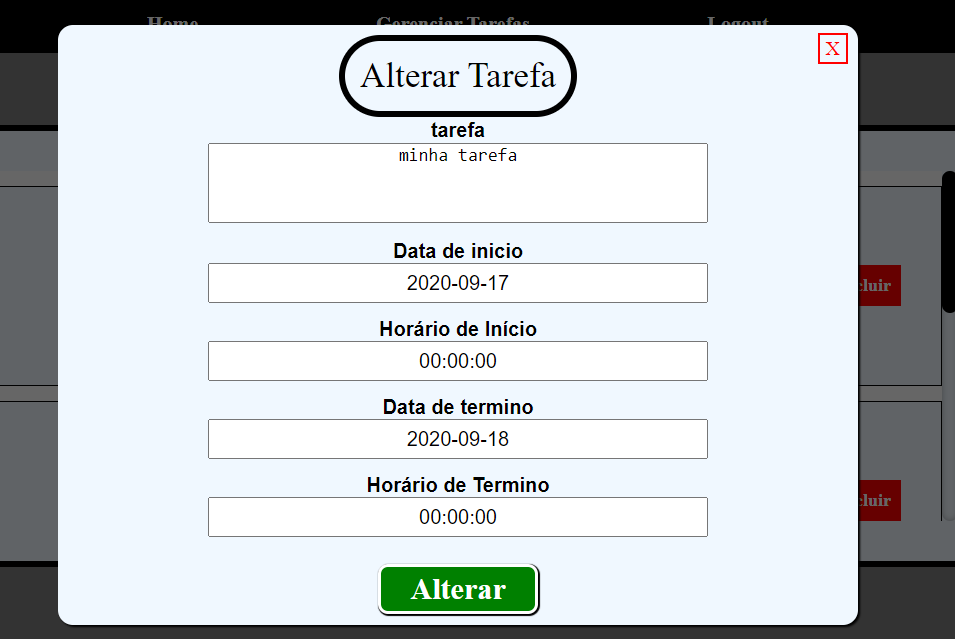
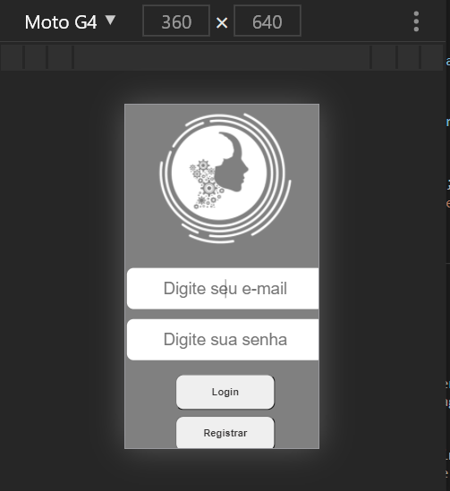
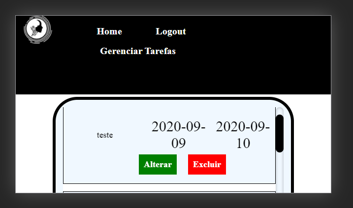

Um cadastro básico feito em javascript

# Projeto em execução

 

### Desenvolvimento

## Linhagens

 - Javascript

## Frameworks, ambiente de execução e outros meios utilizados

   - node.js
   - React.js
   - express.js
   - MongoDB
   - Google Chrome

## Ferramentas utilizadas
 - Visual Studio code
 - Insomnia
 - Adobe XD
 - Photoshop
 - Insomnia

# Como Executar esse projeto 
Para executar esse projeto você deve ter instalados em sua máquina os seguintes programas:

 - Node.Js 12 LTS
 - MongoDB
 - yarn

Primeiramente você deve executar o comando `yarn` com o terminal posicionado na pasta referente ao backend e depois no frontend.

### ` yarn dev` na pasta referente ao backend

### `yarn start`  na pasta referente ao frontend

Feito isso, a aplicação poderá ser visualizada no browser com o endereço :

### `http://localhost:3000`

 ### Interfaces

 ### Login

 ### modal

 ### Calendário

 ### Gerenciador de tarefas

 ### Mobile

  ### login

 ### Listagem de informações

 ### modal

 ### Gerenciador de tarefas

Fontes:

### Logo
 - https://agxsoftware.com/
   
